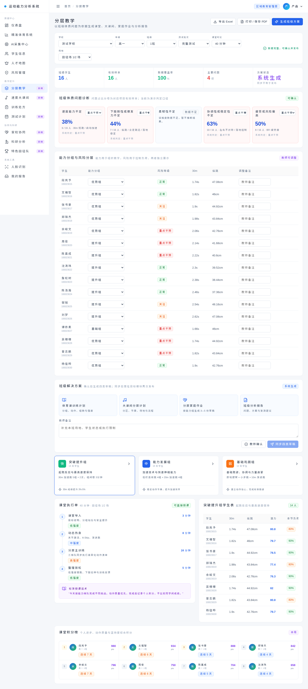

# 【PRD】潘英怡-20260829-B体质健康

> **文档状态：需求已确认，班级体质健康分层教学功能开发中。**
>
> 页面截图和指标为产品演示数据，用于说明现有界面基础与目标流程，不代表真实学校或学生运营结果。

## 1. 修订记录

| 版本号 | 修订日期 | 修订内容 | 修订者 |
|---|---|---|---|
| V1.0 | 2026-08-29 | 学生分析页面能力说明 | 潘英怡 |
| V2.0 | 2026-08-31 | 调整为班级体质健康分层教学闭环需求 | 潘英怡 |
| V2.1 | 2026-08-31 | 按已拆分 Issue 完善目标能力、验收场景与实施计划 | 潘英怡 |

## 2. 相关链接

| 事项 | 内容 |
|---|---|
| 产品需求池 | [GitHub Issue #3](https://github.com/kilbertert/sport-clone/issues/3) |
| 执行子 Issue | [#4—#9](https://github.com/kilbertert/sport-clone/issues/4) |
| 实现 PR | [PR #11](https://github.com/kilbertert/sport-clone/pull/11) |
| 产品环境 | https://sports.pyyi.work/ |
| 设计稿 | 基于现有“分层教学”页面迭代 |

## 3. 需求概述

### 背景

教师需要以班级为单位看整体体质问题，而不是逐个查看学生后再人工汇总。当前系统已有学生分析、分层教学、速度大课间、家校协同和报告导出页面，但缺少统一的班级诊断入口，无法把有效体测数据直接转化为课堂分层、课间训练、家庭作业和复测任务。

### 核心需求

改造现有“分层教学”页面，教师选择学校、年级、班级和测试批次后，系统按项目有效样本识别五类体质问题，展示影响人数、占比、影响项目和严重程度；随后分别形成能力分组与风险等级。教师可调整问题、分组、动作、组数、强度和备注，确认后生成体育课训练计划、大课间分层计划、3—5 份分层家庭作业和班级分析报告，并分别同步到现有模块。

### 预期效果

教师的工作方式由“逐个看学生”转为“先看班级问题、再组织分层干预”。诊断有明确数据口径，教师保留最终确认权，生成、同步、发布和复测状态清晰可追踪。

## 4. 现状与目标

### 4.1 当前可复用能力

| 页面/能力 | 当前基础 |
|---|---|
| 学生分析 | 提供短跑、纵跳、立定跳远、BFI、左右不对称和能力评分等指标 |
| 分层教学 | 已有能力分组、课堂执行单和班级选择基础 |
| 速度大课间 | 已有时长、场地、分区、节奏和动作流程 |
| 家校协同 | 已有家庭作业发布、家长打卡和教师反馈 |
| 报告导出 | 已有页面导出能力，可承接班级报告 |

### 4.2 本次目标能力

以下内容是本 PRD 的建设目标，开发正在进行，不能视为已完成上线：

1. 班级选择、测试批次和有效样本口径。
2. 五类班级体质问题诊断。
3. 能力分组与风险等级双视图。
4. 教师调整、风险保护和确认。
5. 四类成果生成及同步/发布分离。
6. 复测前后对比和状态闭环。

## 5. 需求范围与分工

### 5.1 功能范围

| 功能模块 | 功能描述 | 优先级 | 当前状态 |
|---|---|---|---|
| 班级数据范围 | 选择学校、年级、班级、测试批次，展示学生数、有效样本和覆盖率 | P0 | 开发中 |
| 五类问题诊断 | 识别速度、下肢刚性/爆发力、柔韧性、协调/稳定、疲劳/风险问题 | P0 | 开发中 |
| 分组与风险 | 展示优势/提升/基础组和正常/关注/重点干预等级 | P0 | 开发中 |
| 教师确认 | 支持标签、等级、分组、动作、组数、强度、备注调整 | P0 | 开发中 |
| 四类成果 | 生成体育课、大课间、家庭作业和班级报告草稿 | P0 | 开发中 |
| 同步发布 | 写入对应模块后由目标模块再次确认发布 | P1 | 待完善 |
| 复测闭环 | 比较问题占比和关键指标前后变化 | P2 | 待完善 |

### 5.2 需求分工

| 角色 | 负责人 | 职责 |
|---|---|---|
| 产品经理 | 潘英怡 | 业务规则、验收标准、汇报口径 |
| UI 设计师 | 待分配 | 班级诊断、调整确认和成果状态设计 |
| 前端开发 | 待分配 | 页面交互、草稿同步、状态和导出 |
| 后端开发 | 待分配 | 真实数据、权限、规则和复测持久化 |
| 测试工程师 | 待分配 | 边界数据、跨模块链路和响应式验证 |

## 6. 业务流程

```text
教师选择学校 / 年级 / 班级 / 测试批次
  → 校验有效样本和覆盖率
  → 识别五类班级体质问题
  → 展示能力分组和风险等级
  → 教师调整并填写备注/原因
  → 教师确认班级诊断
  → 生成四类成果草稿
  → 分别同步到分层教学、速度大课间、家校协同和报告区
  → 在目标模块再次确认发布
  → 执行、复测并对比前后变化
```

## 7. 功能详细说明

### 7.1 班级体质健康分层教学

**功能定位：**

以班级为唯一分析对象，将有效体测数据转化为问题诊断、能力分层、风险控制和四类可执行成果。该功能改造现有分层教学页面，服务体育教师的班级备课与干预工作。

**页面组成：**

| 页面区域 | 功能说明 | 输出内容 |
|---|---|---|
| 班级筛选区 | 选择学校、年级、班级和测试批次 | 当前班级数据范围 |
| 数据口径区 | 显示班级学生数、有效样本、覆盖率和最近测试时间 | 样本充分性判断 |
| 五类问题区 | 识别并展示五类体质问题 | 人数、占比、影响项目、严重程度 |
| 分组分层区 | 分别展示能力组和风险等级 | 优势/提升/基础组；正常/关注/重点干预 |
| 教师调整区 | 调整诊断、分组和训练参数 | 教师最终值、调整原因和备注 |
| 成果输出区 | 生成四类草稿并展示状态 | 体育课、大课间、家庭作业、班级报告 |
| 闭环区 | 管理同步、发布和复测状态 | 当前状态与前后对比 |

**产品规则：**

1. 教师分析粒度固定为班级；年级、全校、区域只作为后续管理视角，不在首期教师入口开放。
2. 每项问题占比使用该项目有效测试学生数作为分母，并显示有效样本数。
3. 缺少某项测试数据时显示“该维度数据不足”，不推断正常或异常。
4. 五类问题为速度能力不足、下肢刚性或爆发力不足、柔韧性不足、协调性或稳定性不足、疲劳或风险偏高。
5. 首期演示严重程度为：`<10%` 正常、`10%—19.9%` 轻度、`20%—29.9%` 关注、`≥30%` 重点干预，并综合同年级参考值。
6. 仅当覆盖率达到 80% 时允许教师确认和发布；60%—79.9% 只能预览；低于 60% 显示数据不足。
7. 能力分组为优势组、提升组、基础组；风险等级为正常、关注、重点干预，两者必须独立展示。
8. 高风险学生调整至高强度能力组时必须二次确认并填写调整原因。
9. 家庭作业按能力分组生成 3—5 份，不逐学生单独生成。
10. 同步只写入目标模块草稿，目标模块再次确认后才正式发布。

**字段定义：**

| 字段名 | 类型 | 是否必填 | 说明 |
|---|---|---|---|
| 学校 | 枚举 | 是 | 当前数据域学校 |
| 年级 | 枚举 | 是 | 当前数据域年级 |
| 班级 | 枚举 | 是 | 当前分析班级 |
| 测试批次 | 枚举 | 是 | 完整测试、阶段复测或其他批次 |
| 学生数 | number | 是 | 班级学生总数 |
| 有效样本数 | number | 是 | 对应项目有有效结果的学生数 |
| 数据覆盖率 | number | 是 | 有效样本占班级学生数比例 |
| 问题类型 | enum | 是 | 五类问题之一 |
| 影响人数 | number | 是 | 命中问题规则的学生数 |
| 问题占比 | number | 是 | 影响人数/项目有效样本 |
| 严重程度 | enum | 是 | 正常、轻度、关注、重点干预 |
| 能力分组 | enum | 是 | 优势组、提升组、基础组 |
| 风险等级 | enum | 是 | 正常、关注、重点干预 |
| 训练动作 | text/list | 是 | 教师确认后的动作方案 |
| 训练组数 | number | 是 | 每项训练建议组数 |
| 训练强度 | enum | 是 | 低、中、高 |
| 教师备注 | text | 否 | 场地、学生状态或执行限制 |
| 调整原因 | text | 条件必填 | 高风险调整时必填 |
| 方案状态 | enum | 是 | 系统生成、教师调整、教师确认、已同步、已发布、待复测、已复测 |

**五类问题与指标映射：**

| 问题类型 | 指标来源 | 主要方案方向 |
|---|---|---|
| 速度能力不足 | 30m/50m 跑、启动加速 | 加速跑、折返跑和速度技术 |
| 下肢刚性或爆发力不足 | 纵跳、立定跳远、落地稳定 | 下肢力量、跳跃和落地控制 |
| 柔韧性不足 | 坐位体前屈等柔韧指标 | 拉伸、活动度和动作幅度 |
| 协调性或稳定性不足 | 动作协调、左右不对称、落地控制 | 单侧稳定、协调和动作纠正 |
| 疲劳或风险偏高 | BFI 疲劳度、风险等级 | 降低负荷、充分恢复和复测 |

**四类成果：**

1. **体育课训练计划：** 根据能力组输出课堂目标、训练动作、组数、强度、间歇和执行流程。
2. **大课间分层计划：** 根据班级问题输出训练分区、节奏、场地和动作流程。
3. **分层家庭作业：** 按优势、提升、基础等能力组生成 3—5 份家庭训练草稿，教师确认后进入家校协同。
4. **班级分析报告：** 输出班级信息、样本口径、五类问题、分组结果、方案摘要和复测建议，支持页面预览、PDF 和 Excel。

**状态流转：**

```text
系统生成 → 教师调整 → 教师确认 → 已同步 → 已发布 → 待复测 → 已复测
```

**交互说明：**

- 更换学校、年级、班级或测试批次时，页面所有数据和方案预览同步刷新。
- 教师修改问题等级、分组或训练参数后，状态变为“教师调整”。
- 高风险学生进入高强度组的操作必须弹出二次确认。
- 覆盖率不足时保留预览内容，但禁用确认和发布。
- “同步四类草稿”只写入目标模块，不直接发布家长作业。
- 复测后展示问题占比和关键指标相对上一次结果的变化。

**异常处理：**

- 班级不存在或无权限：不展示学生信息，提示无可用数据。
- 项目无有效样本：显示“该维度数据不足”。
- 覆盖率 60% 以下：显示数据不足，禁止正式方案确认。
- 高风险调整未填写原因：确认按钮保持禁用。
- 目标模块同步失败：保留当前草稿和失败提示，不将状态标记为已同步。

**页面截图：**



*图 B-1：当前实现页面已展示班级筛选、有效样本、五类问题、能力/风险分层和四类成果区域；截图中的指标为演示数据。*

## 8. 数据权限与隐私

1. 班级体育教师和学校管理员可查看授权班级的完整学生姓名和指标。
2. 区域管理者默认查看汇总人数与比例，不直接修改教师分组和方案。
3. 家长端仅能查看本人学生及已发布的家庭作业。
4. 学生姓名、体测结果、风险等级属于学生敏感数据，正式环境需由后端权限和审计控制。

## 9. 验收场景与 QA

### 9.1 验收场景

完整 Gherkin 场景见 [GitHub Issue #3](https://github.com/kilbertert/sport-clone/issues/3)；覆盖班级选择、五类问题、低覆盖率、高风险调整、四类成果同步和复测对比。

### 9.2 QA 重点

1. 验证项目有效样本分母和 10%、20%、30% 阈值边界。
2. 验证 60% 和 80% 覆盖率的预览、确认、发布限制。
3. 验证能力分组与风险等级独立调整。
4. 验证同步不等于发布，以及大课间、家校协同的二次确认。
5. 验证桌面端和移动端无水平溢出。

## 10. 实施计划

| 阶段 | 交付内容 | Issue |
|---|---|---|
| 第一阶段 | 班级选择与有效样本口径 | [#4](https://github.com/kilbertert/sport-clone/issues/4) |
| 第二阶段 | 五类体质问题诊断 | [#5](https://github.com/kilbertert/sport-clone/issues/5) |
| 第三阶段 | 能力分组与风险分层 | [#6](https://github.com/kilbertert/sport-clone/issues/6) |
| 第四阶段 | 教师调整与风险保护 | [#7](https://github.com/kilbertert/sport-clone/issues/7) |
| 第五阶段 | 四类成果生成与模块同步 | [#8](https://github.com/kilbertert/sport-clone/issues/8) |
| 第六阶段 | 复测闭环与前后对比 | [#9](https://github.com/kilbertert/sport-clone/issues/9) |

## 11. 附录

- 当前技术基础：React/Vite 前端演示系统，新增诊断计算模块和本地草稿状态。
- 当前限制：真实后端数据、正式指标标准、PDF 服务端生成、权限审计和复测持久化尚未完成。
- 汇报口径：本 PRD 以当前页面基础和已确认建设目标为主，不能将开发中能力描述为生产已上线能力。
