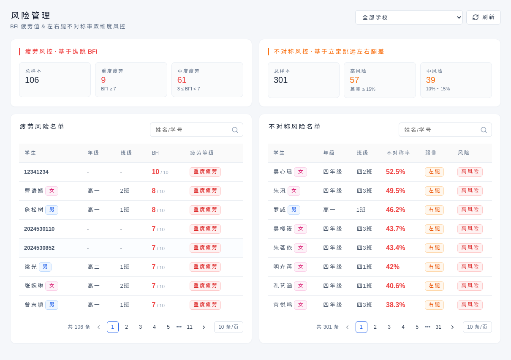
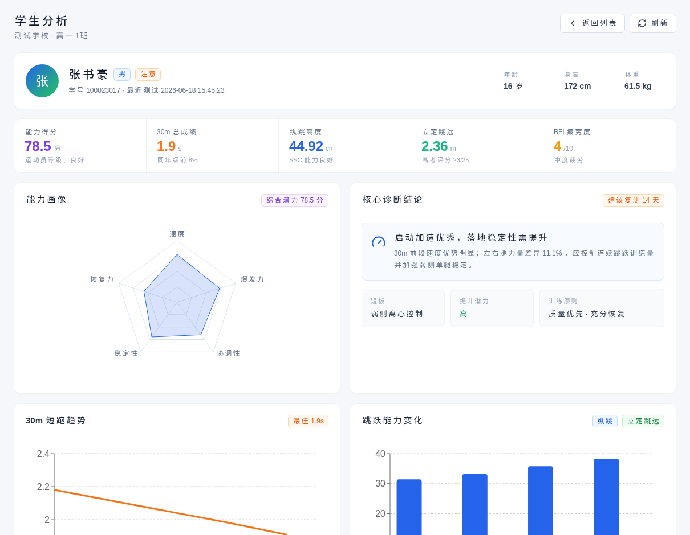
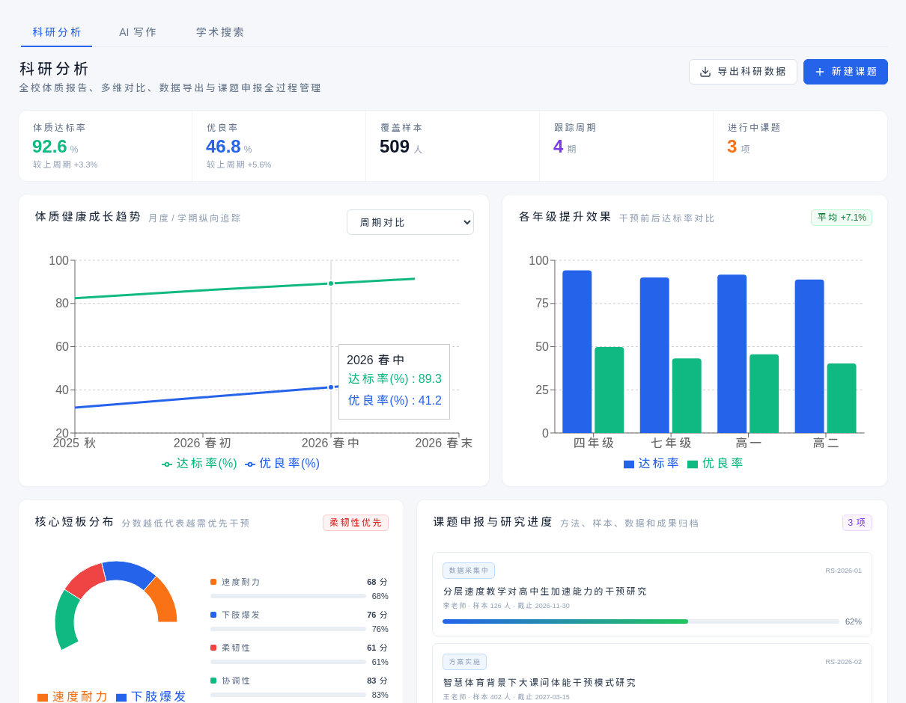

# 【PRD】潘英怡-20260829-B体质健康

> **数据声明：当前截图与指标为产品演示数据，用于说明功能和业务流程，不代表真实区域、学校或学生运营结果。**

## 1. 修订记录

| 版本号 | 修订日期 | 修订内容 | 修订者 |
|---|---|---|---|
| V1.0 | 2026-08-29 | 基于生产网站现有能力形成初稿 | 潘英怡 |

## 2. 相关链接

| 事项 | 内容 |
|---|---|
| 产品需求池 | 待补充 |
| 产品环境 | https://sports.pyyi.work/ |
| 设计稿 | 以生产网站截图为准 |

## 3. 需求概述

### 背景

学校体质健康管理通常包含群体数据汇总、异常风险发现、学生个体分析和周期趋势评估。若这些信息分散在不同表格或单次测试报告中，管理者难以及时识别重点人群，教师也难以将测试结果转化为具体干预动作。

### 核心需求

系统围绕“区域总览—风险发现—个体诊断—趋势研究”形成 B 体质健康业务链路，通过精准体育驾驶舱、风险管理、学生分析和科研分析四个页面展示当前已完成能力，并支持筛选、建议生成、数据导出和研究项目管理。

### 预期效果

区域管理者和学校体育教师能够快速掌握整体达标水平、定位风险学生、查看个人能力短板，并通过周期趋势判断干预效果，为分层教学、训练处方和管理决策提供数据依据。

## 4. 需求背景与目标

### 4.1 当前业务目标

1. 提供区域与学校体质健康总览，集中呈现覆盖率、达标率和核心卡点。
2. 识别疲劳、不对称和落地稳定等风险，为复核与干预提供名单。
3. 形成学生个人运动能力诊断，关联风险、成绩趋势和训练建议。
4. 支持体质变化趋势与年级对比，为科研评估和管理复盘提供材料。

### 4.2 用户角色

| 用户角色 | 核心诉求 |
|---|---|
| 区域教育管理者 | 查看区域整体表现、学校差异和优先管理事项 |
| 学校管理者 | 定位本校年级短板与重点风险学生 |
| 体育教师 | 查看个体诊断并形成复测或训练建议 |
| 教研人员 | 观察周期趋势、导出数据并管理研究课题 |

## 5. 需求范围与分工

### 5.1 当前已完成范围

| 模块 | 当前能力 | 优先级 |
|---|---|---|
| 精准体育系统 | KPI、风险预警、人才储备、学校排名、达标率、趋势与管理建议 | P0 |
| 风险管理 | 疲劳值与左右腿不对称双维风险筛查 | P0 |
| 学生分析 | 个体能力指标、风险解释、趋势和运动处方入口 | P0 |
| 科研分析 | 体质趋势、年级对比、数据导出和课题管理 | P1 |

### 5.2 需求分工

| 角色 | 负责人 | 职责 |
|---|---|---|
| 产品经理 | 潘英怡 | 业务范围、规则和验收标准 |
| UI 设计师 | 待分配 | 页面信息层级与交互规范 |
| 前端开发 | 待分配 | 页面展示、筛选和导出交互 |
| 后端开发 | 待分配 | 后续真实数据、权限和持久化服务 |
| 测试工程师 | 待分配 | 页面、数据口径和业务链路验证 |

## 6. 业务流程

```text
体测数据汇总
  → 区域/学校体质总览
  → 识别风险与年级短板
  → 查看学生个体分析
  → 生成复测或训练建议
  → 通过科研趋势评估阶段变化
```

## 7. 功能详细说明

### 7.1 精准体育系统

**功能定位：** 作为体质健康管理驾驶舱，集中展示整体指标、重点风险和管理优先级。

**当前能力：**

1. 支持学校、年级筛选和管理简报导出。
2. 展示受伤风险人数、专项人才储备、核心卡点年级和数据覆盖率。
3. 展示风险名单、项目达标率、年级趋势、群体比例和分级管理建议。
4. 各模块提供优点与缺点摘要，辅助快速判断。

| 字段 | 类型 | 必填 | 说明 |
|---|---|---|---|
| 学校 | 枚举 | 是 | 当前数据范围 |
| 年级 | 枚举 | 是 | 当前年级范围 |
| 风险人数 | 数值 | 是 | 当前口径下待干预人数 |
| 数据覆盖率 | 百分比 | 是 | 已采集数据覆盖情况 |
| 管理建议 | 文本 | 是 | 立即、本周、规划三级建议 |

**异常处理：** 筛选无匹配数据时保留模块结构并显示“暂无数据”，不得沿用其他范围的数据。


*图 B-1：集中呈现体质指标、风险名单、年级短板和管理建议。完整页面见 [B-01-full.png](./assets/b-health/B-01-full.png)。*

### 7.2 风险管理

**功能定位：** 从疲劳恢复和左右腿不对称两个维度筛查需要重点复核的学生。

**当前能力：** 支持学校筛选、风险名单刷新、风险指标对比和重点学生识别；风险结果用于体育干预提示，不作为医疗诊断。

| 字段 | 类型 | 必填 | 说明 |
|---|---|---|---|
| BFI 疲劳值 | 数值 | 是 | 疲劳风险参考指标 |
| 不对称率 | 百分比 | 是 | 左右侧能力差异 |
| 风险等级 | 枚举 | 是 | 高、中、低风险 |
| 建议动作 | 文本 | 是 | 复核、恢复或动作纠正建议 |



*图 B-2：通过疲劳与不对称指标定位重点复核对象。完整页面见 [B-02-full.png](./assets/b-health/B-02-full.png)。*

### 7.3 学生分析

**功能定位：** 将学生基础信息、测试表现、风险和训练建议汇总为个人分析档案。

**当前能力：** 展示个人关键指标、趋势图、能力结构与风险提示，并提供创建训练处方的业务入口。

| 字段 | 类型 | 必填 | 说明 |
|---|---|---|---|
| 学生标识 | 文本 | 是 | 学生唯一标识 |
| 测试成绩 | 数值 | 是 | 各测试项目结果 |
| 能力评分 | 数值 | 是 | 速度、爆发等维度表现 |
| 训练建议 | 文本 | 是 | 当前诊断对应的训练方向 |



*图 B-3：从群体风险下钻到学生个人能力与处方建议。完整页面见 [B-03-full.png](./assets/b-health/B-03-full.png)。*

### 7.4 科研分析

**功能定位：** 对体质健康数据进行周期追踪、年级比较和研究项目管理。

**当前能力：** 展示达标率、优良率、样本量、周期趋势和年级提升效果；支持科研数据导出及课题档案创建。

| 字段 | 类型 | 必填 | 说明 |
|---|---|---|---|
| 达标率 | 百分比 | 是 | 当前周期体质达标比例 |
| 优良率 | 百分比 | 是 | 当前周期优良比例 |
| 跟踪周期 | 数值 | 是 | 已纳入比较的周期数 |
| 研究项目 | 对象 | 否 | 课题名称、负责人、样本和进度 |



*图 B-4：通过周期趋势、年级对比和课题档案支撑教研评估。完整页面见 [B-04-full.png](./assets/b-health/B-04-full.png)。*

## 8. 数据埋点建议

| 功能 | 页面 | 事件 | 终端 |
|---|---|---|---|
| 查看体质驾驶舱 | /precision | page_view_precision | H5 |
| 切换学校/年级 | /precision | filter_change_health_scope | H5 |
| 查看风险名单 | /risk | page_view_risk | H5 |
| 创建训练处方 | /students/:id | btn_click_create_prescription | H5 |
| 导出科研数据 | /research | btn_click_export_research | H5 |

## 9. 验收标准

1. 四个页面可从生产环境正常访问，页面核心内容与截图一致。
2. 精准体育系统能够展示总体指标、风险名单、趋势和管理建议。
3. 风险名单可表达疲劳与不对称两个风险维度。
4. 学生分析能够从个体数据进入训练处方业务流程。
5. 科研分析能够展示周期趋势并支持数据导出和课题创建。
6. 所有演示指标均明确标注为演示数据，不作为真实业务结论。

## 10. 下一阶段规划（简要）

- **P0：** 接入真实体测数据、多级数据权限和干预复测闭环。
- **P1：** 增加历史报告、指标口径版本和长期趋势留存。
- **P2：** 在数据合规前提下增加高级分析和跨校比较。

## 11. 附录

- 截图时间：2026-08-29
- 截图环境：https://sports.pyyi.work/
- 截图尺寸：桌面端 1440 × 1000，完整页面截图采用全页高度。
