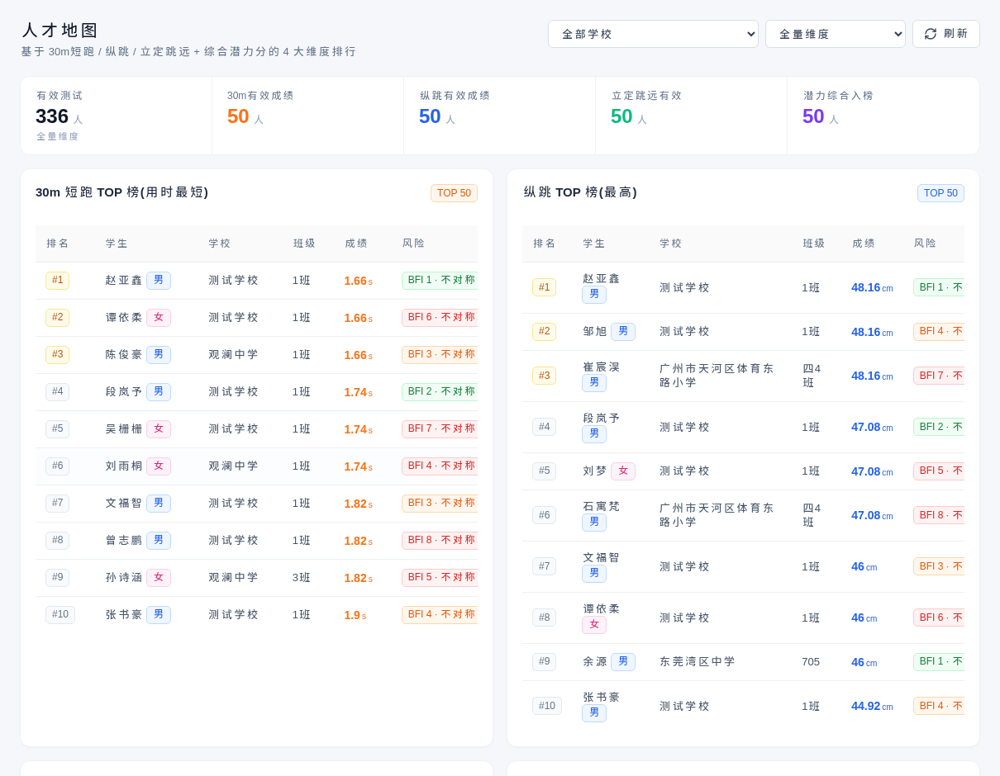
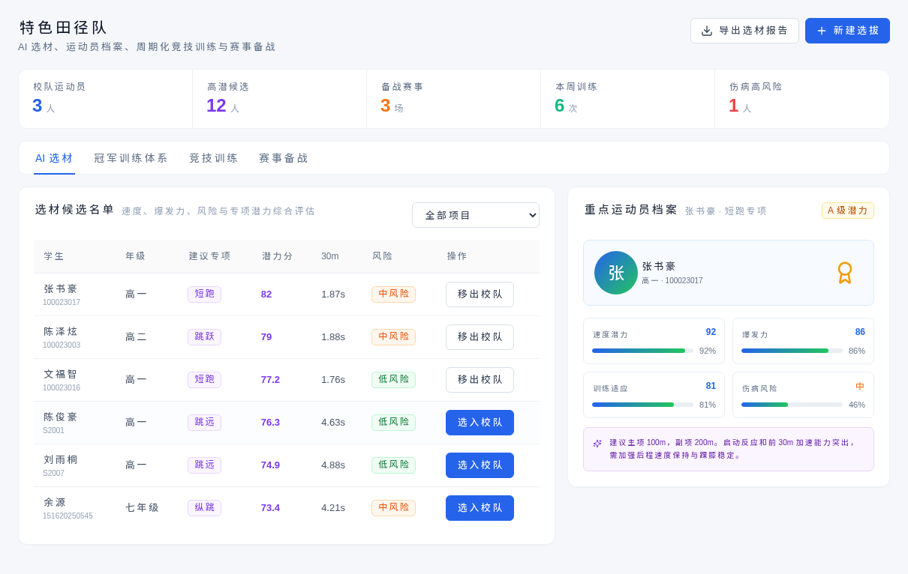
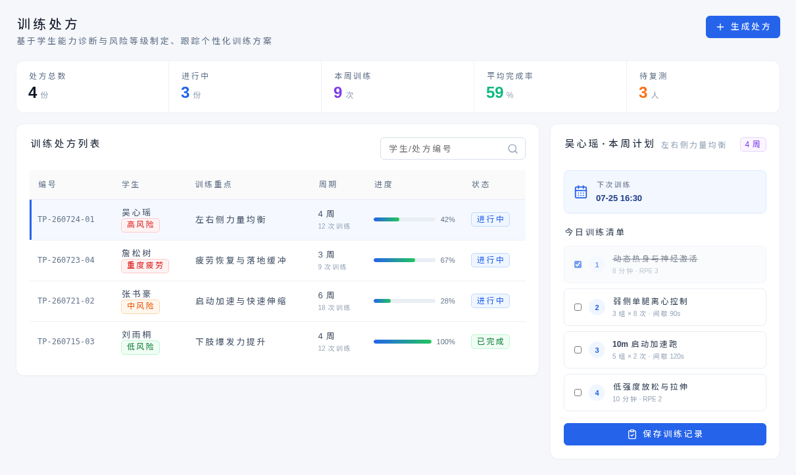
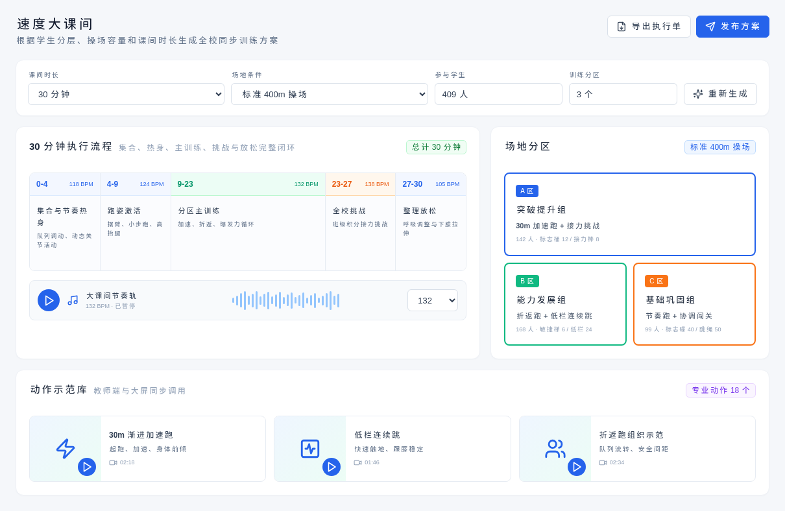

# 【PRD】潘英怡-20260829-C体育特色

> **数据声明：当前截图与指标为产品演示数据，用于说明功能和业务流程，不代表真实区域、学校或学生运营结果。**

## 1. 修订记录

| 版本号 | 修订日期 | 修订内容 | 修订者 |
|---|---|---|---|
| V1.0 | 2026-08-29 | 基于生产网站现有能力形成初稿 | 潘英怡 |

## 2. 相关链接

| 事项 | 内容 |
|---|---|
| 产品需求池 | 待补充 |
| 产品环境 | https://sports.pyyi.work/ |
| 设计稿 | 以生产网站截图为准 |

## 3. 需求概述

### 背景

学校体育特色建设既需要发现具有专项潜力的学生，也需要把选材结果转化为持续训练、赛事准备和全校体育活动。传统人工选材依赖经验，候选依据、训练过程和推广成果难以形成统一记录，特色项目容易停留在个别教师或单支校队层面。

### 核心需求

系统围绕“人才发现—校队选材—专项训练—全校推广”形成 C 体育特色业务链路，通过人才地图、特色田径队、训练处方和速度大课间四个页面展示当前已完成能力，覆盖专项排行、候选评估、运动员档案、训练计划和校本活动执行。

### 预期效果

学校能够依据测试数据识别专项潜力，建立可解释的候选名单和运动员档案，为校队成员生成训练计划，并将成熟训练方法转化为可执行的大课间方案，形成从竞技培养到全校普及的特色体育体系。

## 4. 需求背景与目标

### 4.1 当前业务目标

1. 基于速度、爆发力和综合潜力发现专项运动人才。
2. 建立候选评估、入队操作和重点运动员档案。
3. 生成并跟踪面向个人或专项的训练计划。
4. 将特色训练内容转化为全校可执行的大课间活动。

### 4.2 用户角色

| 用户角色 | 核心诉求 |
|---|---|
| 学校管理者 | 掌握特色项目人才规模、训练和赛事准备情况 |
| 校队教练 | 筛选候选学生、查看档案并制定专项训练 |
| 体育教师 | 将训练方法转化为课堂或大课间执行方案 |
| 学生 | 获得与自身能力和专项方向匹配的培养建议 |

## 5. 需求范围与分工

### 5.1 当前已完成范围

| 模块 | 当前能力 | 优先级 |
|---|---|---|
| 人才地图 | 多维专项排行、学校筛选和潜力比较 | P0 |
| 特色田径队 | AI 选材展示、候选名单、运动员档案和训练体系 | P0 |
| 训练处方 | 创建、跟踪和展示个性化训练计划 | P0 |
| 速度大课间 | 时长、场地、分区、节奏和动作示范方案 | P1 |

### 5.2 需求分工

| 角色 | 负责人 | 职责 |
|---|---|---|
| 产品经理 | 潘英怡 | 业务范围、规则和验收标准 |
| UI 设计师 | 待分配 | 选材、训练和执行场景交互 |
| 前端开发 | 待分配 | 排行、档案、计划和方案页面实现 |
| 后端开发 | 待分配 | 后续真实选材、训练和赛事数据服务 |
| 测试工程师 | 待分配 | 业务流程与页面操作验证 |

## 6. 业务流程

```text
体测与运动能力数据
  → 人才地图识别专项潜力
  → 特色田径队审核候选并建立档案
  → 生成个人或专项训练处方
  → 将成熟训练方法用于速度大课间
  → 复测结果回到人才评价与训练调整
```

## 7. 功能详细说明

### 7.1 人才地图

**功能定位：** 从全校或区域测试数据中发现具有短跑、纵跳、跳远或综合潜力的学生。

**当前能力：** 支持学校和维度筛选，展示多类项目排行、成绩和综合潜力，为后续校队选材提供候选依据。

| 字段 | 类型 | 必填 | 说明 |
|---|---|---|---|
| 学校 | 枚举 | 是 | 当前人才筛选范围 |
| 专项维度 | 枚举 | 是 | 短跑、纵跳、跳远或综合潜力 |
| 项目成绩 | 数值 | 是 | 对应测试项目结果 |
| 潜力分 | 数值 | 是 | 候选比较分值 |



*图 C-1：以多维排行发现专项潜力学生，为校队选材提供入口。完整页面见 [C-01-full.png](./assets/c-sports/C-01-full.png)。*

### 7.2 特色田径队

**功能定位：** 管理校队候选、重点运动员、周期训练和赛事备战。

**当前能力：** 展示校队规模、候选人数、赛事和训练指标；支持按项目查看候选名单、执行入队操作、查看运动员能力档案并导出选材报告。

| 字段 | 类型 | 必填 | 说明 |
|---|---|---|---|
| 建议专项 | 枚举 | 是 | 推荐培养项目 |
| 潜力分 | 数值 | 是 | 候选综合评价 |
| 风险等级 | 枚举 | 是 | 训练风险参考 |
| 入队状态 | 枚举 | 是 | 候选、已入队或移出 |
| 运动员档案 | 对象 | 是 | 能力、适应度和风险信息 |



*图 C-2：连接候选筛选、入队操作和重点运动员能力档案。完整页面见 [C-02-full.png](./assets/c-sports/C-02-full.png)。*

### 7.3 训练处方

**功能定位：** 将学生能力诊断与专项培养方向转化为可跟踪的训练计划。

**当前能力：** 支持创建训练处方，记录训练重点、周期、风险等级、执行状态和计划内容，并展示现有计划列表。

| 字段 | 类型 | 必填 | 说明 |
|---|---|---|---|
| 学生 | 对象 | 是 | 训练对象 |
| 训练重点 | 文本 | 是 | 本周期主要目标 |
| 周期 | 文本 | 是 | 训练持续时间 |
| 风险等级 | 枚举 | 是 | 训练负荷参考 |
| 状态 | 枚举 | 是 | 草稿、进行中或已完成 |



*图 C-3：把诊断结果和专项方向转化为可执行训练计划。完整页面见 [C-03-full.png](./assets/c-sports/C-03-full.png)。*

### 7.4 速度大课间

**功能定位：** 将特色速度训练方法转化为全校可同步执行的校本体育活动。

**当前能力：** 支持配置课间时长、场地、学生规模和训练分区；展示完整执行流程、节奏、场地区域和动作示范，并支持导出执行单和发布方案。

| 字段 | 类型 | 必填 | 说明 |
|---|---|---|---|
| 课间时长 | 枚举 | 是 | 方案总时长 |
| 场地条件 | 枚举 | 是 | 操场或室内场地 |
| 参与学生 | 数值 | 是 | 计划覆盖人数 |
| 训练分区 | 数值 | 是 | 同时执行的区域数量 |
| 执行流程 | 列表 | 是 | 热身、主训练、挑战和放松 |



*图 C-4：将专项训练内容转化为分区、分时、可发布的大课间方案。完整页面见 [C-04-full.png](./assets/c-sports/C-04-full.png)。*

## 8. 数据埋点建议

| 功能 | 页面 | 事件 | 终端 |
|---|---|---|---|
| 查看人才排行 | /talent | page_view_talent_map | H5 |
| 候选学生入队 | /team | btn_click_team_select | H5 |
| 查看运动员档案 | /team | athlete_profile_view | H5 |
| 创建训练处方 | /training | form_submit_training_plan | H5 |
| 发布大课间方案 | /recess | btn_click_publish_recess | H5 |

## 9. 验收标准

1. 四个页面可从生产环境正常访问，页面核心内容与截图一致。
2. 人才地图能够按专项维度展示候选学生排行。
3. 特色田径队能够执行候选入队操作并展示重点运动员档案。
4. 训练处方能够创建并展示训练计划。
5. 速度大课间能够配置方案、查看动作示范并发布执行方案。
6. 所有演示指标均明确标注为演示数据，不作为真实选材结论。

## 10. 下一阶段规划（简要）

- **P0：** 接入真实选材标准、审核流程、训练记录和复测闭环。
- **P1：** 增加赛事档案、成绩记录和训练效果对比。
- **P2：** 增加可配置专项权重与跨校特色项目比较。

## 11. 附录

- 截图时间：2026-08-29
- 截图环境：https://sports.pyyi.work/
- 截图尺寸：桌面端 1440 × 1000，完整页面截图采用全页高度。
